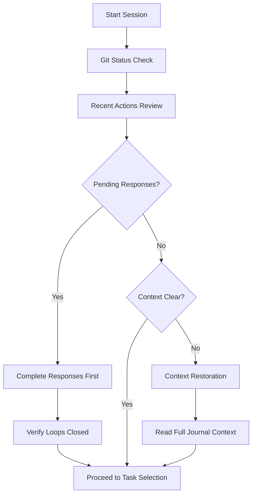

---
match:
  keywords:
    - "session startup"
    - "recent actions"
    - "memory failure"
    - "autonomous session"
    - "context review"
    - "phase 1"
---

# Session Startup Recent Actions Review

## Purpose
Enhance Phase 1 of autonomous sessions with systematic recent actions review to prevent memory failure patterns and ensure proper context continuity.

## Integration with Autonomous Session Structure

### Enhanced Phase 1: Quick Status Check + Recent Actions Review

**Standard Phase 1** (2-3 minutes):
1. Check git status
2. Check journal context
3. **NEW**: Recent Actions Review
4. **NEW**: Communication Loop Verification

### Recent Actions Review Protocol

Add these commands to every autonomous session startup:

```bash
echo "=== RECENT ACTIONS REVIEW ==="

# 1. Recent Commits Analysis (last 3 days)
echo "Recent commits by me:"
git log --oneline --since="3 days ago" --author="$(git config user.name)" | head -10

# 2. Recent Issues/PRs Created
echo -e "\nRecent GitHub activity:"
gh issue list --author @me --limit 5 --json number,title,createdAt,url
gh pr list --author @me --limit 3 --json number,title,createdAt,url

# 3. Recent Journal Entries Context
echo -e "\nRecent session summaries:"
ls -1 journal/ | tail -3 | xargs -I {} sh -c 'echo "=== {} ==="; head -10 journal/{}'

# 4. Active Task Context
echo -e "\nActive tasks review:"
./scripts/tasks.py status --compact

echo "=== END RECENT ACTIONS REVIEW ==="
```

### Communication Loop Verification

Add after recent actions review:

```bash
echo "=== COMMUNICATION LOOP VERIFICATION ==="

# Check for pending responses in work queue
if [ -f work-queue.md ]; then
  echo "Checking pending responses:"
  grep -A 5 "Pending Responses" work-queue.md || echo "No work queue found"
else
  echo "⚠️  No work-queue.md found - create one if you have pending responses"
fi

# Prompt for self-assessment
echo -e "\nSELF-ASSESSMENT QUESTIONS:"
echo "1. Did my recent commits complete any requested actions?"
echo "2. Have I responded back to ALL requestors in original locations?"
echo "3. Are there any communication loops I left open?"
echo "4. Do I need to add anything to pending responses tracking?"

echo "=== END COMMUNICATION LOOP VERIFICATION ==="
```

## Critical Decision Points

After running the review, ask these questions:

### 1. Immediate Response Required?
- If recent actions completed requests → **STOP and respond immediately**
- If pending responses found → **Complete them before new work**
- If communication loops broken → **Fix them now**

### 2. Context Gaps Identified?
- If unclear what recent work means → **Read full journal entries**
- If tasks seem disconnected → **Review task relationships**
- If duplicate work suspected → **Run duplicate check**

### 3. Session Focus Direction?
- If urgent responses needed → **Response completion session**
- If context clear → **Continue planned work**
- If major confusion → **Context restoration session**

## Session Startup Decision Tree



## Enhanced Phase 1 Template

```bash
#!/bin/bash
# Enhanced Autonomous Session Phase 1

echo "=== PHASE 1: ENHANCED STATUS CHECK ==="

# Standard checks
git status
echo -e "\nRecent journal context:"
ls -la journal/ | tail -3

# NEW: Recent Actions Review
source session-startup-recent-actions-review.sh

# NEW: Decision point
echo -e "\n=== PHASE 1 DECISION POINT ==="
echo "Based on review above:"
echo "- Any urgent responses needed? (If YES: handle before Phase 2)"
echo "- Context clear for new work? (If NO: extend Phase 1)"
echo "- Ready to proceed to task selection? (If YES: continue to Phase 2)"

echo "=== PHASE 1 COMPLETE ==="
```

## Integration Benefits

Following this enhanced Phase 1 provides:

1. **Memory Continuity**: Clear view of recent work and context
2. **Response Accountability**: Immediate detection of broken communication loops
3. **Duplicate Prevention**: Awareness of recent similar work
4. **Priority Clarity**: Urgent responses surface before new work starts
5. **Context Efficiency**: Faster startup through systematic review

## Success Metrics

- **Response Completion Rate**: 100% of pending responses handled
- **Duplicate Reduction**: Zero duplicate issues after review implementation
- **Context Accuracy**: Agent decisions aligned with recent work context
- **Session Efficiency**: Faster transition from startup to productive work

## Related Components

This integrates with:
- [Pre-Issue Creation Checklist](./pre-issue-creation-checklist.md)
- [Memory Failure Prevention](./memory-failure-prevention.md)
- [Communication Loop Closure Patterns](./communication-loop-closure-patterns.md)

## Implementation Notes

- Add to gptme-contrib autonomous session templates
- Include in agent workspace setup procedures
- Test with real autonomous sessions for effectiveness
- Gather feedback from other agents for refinement
