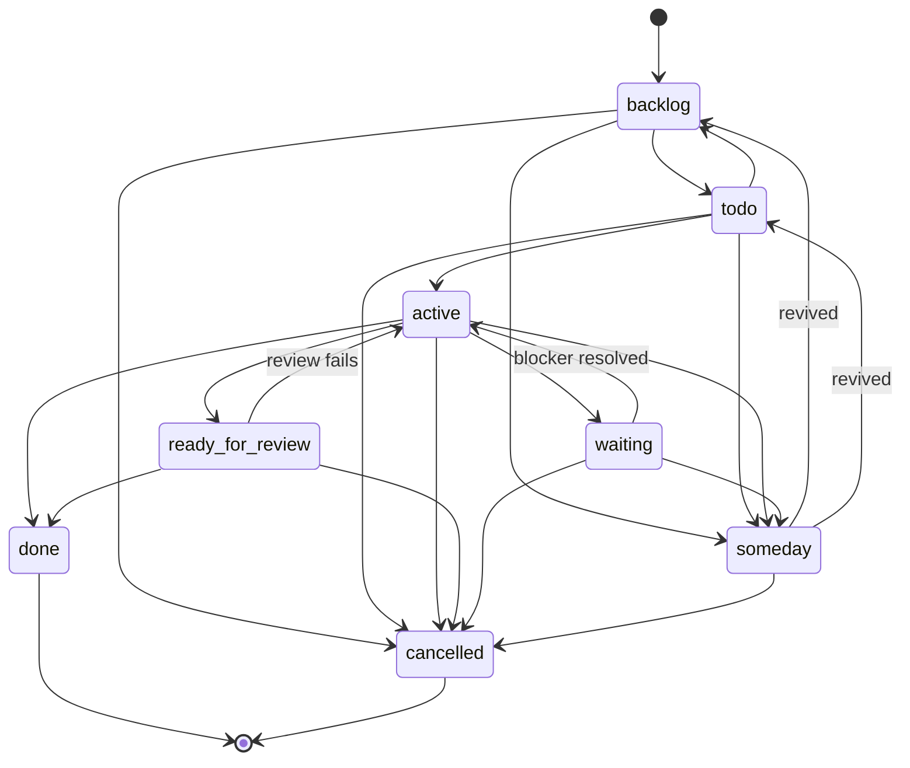

# gptodo

Task management and work queue generation utilities for gptme agents.

## Features

- Manage tasks with YAML frontmatter metadata
- Generate work queues from task files and GitHub issues
- Prioritize tasks based on priority labels and assignments
- Task locking for multi-agent coordination
- Support for multiple task sources (local files, GitHub)
- Configurable workspace structure

## Installation

### Standalone (Recommended)

Install as a CLI tool:

```bash
# Using uv (recommended)
uv tool install git+https://github.com/gptme/gptme-contrib#subdirectory=packages/gptodo

# Using pipx
pipx install git+https://github.com/gptme/gptme-contrib#subdirectory=packages/gptodo
```

### From gptme-contrib workspace

```bash
# Install with workspace
uv sync

# Or install package directly
uv pip install -e packages/gptodo
```

## Usage

### Task Management CLI

```bash
# View task status
gptodo status
gptodo status --compact

# Show specific task
gptodo show <task-id>

# Edit task metadata
gptodo edit <task-id> --set state active
gptodo edit <task-id> --set priority high
gptodo edit <task-id> --add tag feature

# Validate tasks
gptodo validate

# List tasks with filters
gptodo list --priority high
gptodo list --state active
```

### Machine-Readable Output (`--json`)

Scripts should parse `--json` rather than grep the rendered human output (the
emoji/formatting are not a stable contract).

```bash
# Detect whether any task is active (used by autonomous-run gates)
gptodo status --json | jq -e 'any(.tasks[]; .state == "active")'

# Per-state counts
gptodo status --json | jq '.summary.by_state'
```

Single-type shape (default):

```json
{
  "type": "tasks",
  "tasks": [ { "id": "...", "state": "active", "priority": "high", ... } ],
  "summary": {
    "total": 12,
    "by_state": { "active": 1, "backlog": 11 },
    "issues": 0,
    "untracked": 0
  }
}
```

With `--all`, results are grouped under `types` keyed by directory type, each
holding the same `{type, tasks, summary}` shape. `gptodo list`, `ready`, and
`next` also support `--json` (and `--jsonl`).

### Generate Work Queue

```bash
# Basic usage (current directory as workspace)
gptodo generate-queue

# Specify workspace path
gptodo generate-queue --workspace ~/my-agent

# Specify GitHub username for assignee filtering
gptodo generate-queue --github-username YourUsername
```

### Task Locking (Multi-Agent)

```bash
# Acquire lock on a task
gptodo lock acquire <task-id>

# Release lock
gptodo lock release <task-id>

# Check lock status
gptodo lock status <task-id>
```

### Output

Generates `state/queue-generated.md` with:
- **Current Run**: Summary from latest journal entry
- **Planned Next**: Top 5 prioritized tasks
- **Last Updated**: Timestamp

### Task Sources

1. **Local Task Files** (`tasks/*.md`):
   - Filter: priority=high/urgent AND state=new/active
   - Uses frontmatter metadata

2. **GitHub Issues**:
   - Filter: label=priority:high/urgent AND state=open
   - Boosts score if assigned to configured username

## Configuration

Via command-line arguments or environment variables:

- `TASKS_REPO_ROOT` / `--workspace`: Agent workspace path
- `GITHUB_USERNAME` / `--github-username`: GitHub username for filtering
- `--journal-dir`: Journal directory name (default: journal)
- `--tasks-dir`: Tasks directory name (default: tasks)
- `--state-dir`: State directory name (default: state)

## Task Format

Task files should use frontmatter metadata:

```yaml
---
state: active      # backlog, todo, active, ready_for_review, waiting, someday, done, cancelled
priority: high     # low, medium, high
task_type: project # project (multi-step) or action (single-step)
assigned_to: bob   # agent name
tags: [ai, dev]    # categorization tags
---
# Task Title

Task description...

## Subtasks
- [ ] First subtask
- [x] Completed subtask
```

## State Semantics

The eight canonical states and what they *mean* — not just what they're
called. The autonomous loop drifts when "active" gets used as an opaque
"recently touched" tag; enforcing the semantics is the point of the
`gptodo transitions` table and the `--force` gate on `gptodo edit --set state`.

| State              | Meaning                                                                                                    | In `next`/`ready`? |
| ------------------ | ---------------------------------------------------------------------------------------------------------- | ------------------ |
| `backlog`          | Queued, not yet triaged. Default for newly-created tasks.                                                  | Yes                |
| `todo`             | Triaged and ready to start; unclaimed; nothing is blocking work.                                           | Yes                |
| `active`           | A human or agent is working on it **right now**. Should be paired with `assigned_to` and `assigned_at`.    | No (already owned) |
| `waiting`          | Blocked on an external event (a date, a reply, an approval, a gate firing). Should carry `wait:` and/or `waiting_for:` explaining *what* it's waiting for. | No             |
| `ready_for_review` | Work done, awaiting operator sign-off before `done`. Should reference a commit or PR in the body.          | No                 |
| `someday`          | Parked idea; may or may not ever be picked up. Explicitly excluded from `next`/`ready` (GTD someday/maybe). | No                 |
| `done`             | Terminal. Work merged / criterion met.                                                                     | No (terminal)      |
| `cancelled`        | Terminal. Will not be picked up; rationale in body.                                                        | No (terminal)      |

Legacy deprecated aliases (still accepted with a warning): `new` → `backlog`,
`paused` → `backlog`.

### Common confusions to avoid

- **`active` is NOT "recently touched" or "in-progress work by me generally".**
  It means an agent has claimed the task and is executing on it *in this
  session*. If nobody's actively driving it, it should be `todo`, `waiting`,
  or `someday`. Watch-* tasks that sit waiting for a gate to fire belong in
  `waiting` (with a `wait:` or `waiting_for:` explaining what triggers them),
  not `active`.
- **`waiting` is for external blockers**, not "I haven't gotten to it yet"
  (that's `backlog`/`todo`) and not "I'm blocked on another task" (that's
  handled by `requires:` — the effective state is computed as `blocked`
  automatically). Use `waiting` when a real-world event needs to arrive:
  a date, a message, a PR merge, an approval.
- **`todo` is unclaimed and ready.** If someone starts on it, they should
  transition it to `active` via `gptodo claim` (which also records
  `assigned_to`).
- **`someday` is not the same as `backlog`.** `backlog` says "we'll get to
  this"; `someday` says "maybe never, but keep it around". Only `someday`
  is excluded from `gptodo next`/`ready`.

### Legal transitions



`gptodo transitions` prints the machine-readable table. `gptodo edit --set state X`
enforces legality and refuses illegal transitions unless you pass `--force`
(e.g. reopening a `done` task, or dropping `active` back to `todo` without
finishing / handing off). The escape hatch exists — the check is a nudge,
not a wall — but every `--force` should be a conscious act, not a habit.

## Frontmatter Schema — Known vs. Hallucinated Fields

The set of *supported* frontmatter fields lives in
`KNOWN_FRONTMATTER_FIELDS` (see `src/gptodo/utils.py`). `gptodo lint` scans
task files for anything outside that set and emits a warning.

**Do not add ad-hoc fields.** Autonomous LLM sessions repeatedly invent
plausible-sounding fields under pressure — `modified`, `last_modified`,
`updated_at`, `last_completed` — most of which duplicate information you
can already get for free.

The canonical anti-example is `modified:` (proposed by an autonomous loop
in 2026-07-01 as a "solution" to queue-health monitoring). It was rejected
as an anti-design-goal: it's a high-churn field that would have to be wired
into *every* edit path, and the answer it purports to provide is already
available via:

```bash
python -c "import os; print(os.path.getmtime('tasks/foo.md'))"   # file mtime
git log -1 --format=%ai tasks/foo.md                             # last commit
```

Both are free. Adding a stored `modified` field creates a churn hazard
(every edit forgets to update it, every test needs to inject it, every
diff carries noise) with no net information gain.

The `gptodo lint` command surfaces these to keep the schema clean:

```bash
gptodo lint                        # scan all tasks
gptodo lint tasks/foo.md           # single file
gptodo lint --json                 # machine-readable
gptodo lint --strict               # non-zero exit if warnings found (CI)
```

Deprecated / anti-goal warnings suggest the correct alternative in the
message body. Unknown-field warnings ask you to either add the field to
`KNOWN_FRONTMATTER_FIELDS` (deliberate PR + test) or remove it. Warnings
never reject a task — a fresh loop must still be able to write whatever
frontmatter it decides on; the linter's job is to *nudge* toward the
schema, not gate loop output.

## GitHub Integration

Requires GitHub CLI (`gh`) installed and authenticated:

```bash
gh auth login
```

Priority labels:
- `priority:urgent` - Highest priority
- `priority:high` - High priority
- `priority:medium` - Medium priority (not included in queue)
- `priority:low` - Low priority (not included in queue)

## Development

### Running Tests

```bash
cd packages/gptodo
make test
```

### Type Checking

```bash
cd packages/gptodo
make typecheck
```

## Migration from tasks

If you were using `scripts/tasks.py`, the wrapper script will continue to work
but will show a deprecation warning. To migrate:

1. Install gptodo directly: `uv tool install git+...`
2. Replace `./scripts/tasks.py` calls with `gptodo`
3. All commands remain the same

## Integration

This package is designed to work with:
- gptme autonomous runs
- GitHub issue tracking
- Agent workspace structures

For full autonomous agent setup, see [gptme-agent-template](https://github.com/gptme/gptme-agent-template).
