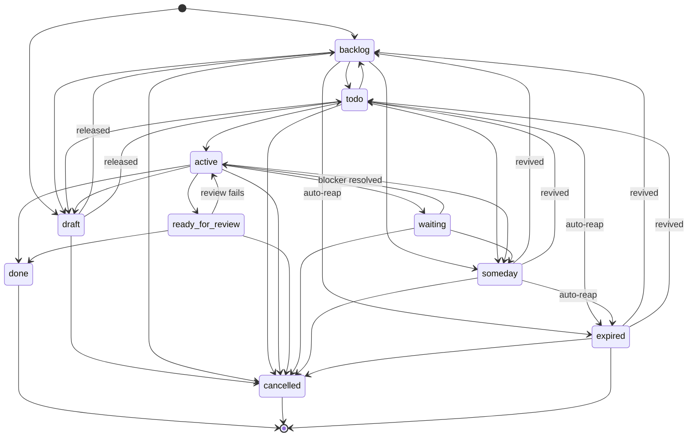

# gptodo

**A file-based task manager and work-queue CLI for autonomous AI agents.** Tasks are
Markdown files with YAML frontmatter in a git repository, so an agent's to-do list
survives across sessions, shows up in diffs, and can be edited by humans and agents alike.
`gptodo` answers the question a long-running agent asks at the start of every session:
*what should I work on next?*

**Status:** beta. Used daily by production [gptme](https://github.com/gptme/gptme) agents.
The core task commands (`status`, `ready`, `next`, `show`, `edit`, `claim`, `add`, `lint`)
are stable; the sub-agent and worktree commands are more experimental.

> **gptodo is optional.** gptme does not require it, and an agent can track work in
> GitHub Issues, Linear, a single `TODO.md`, or anything else. gptodo is one
> well-integrated option, and it can import from GitHub and Linear if you want both.

## Contents

- [Why gptodo](#why-gptodo)
- [How it fits with gptme](#how-it-fits-with-gptme)
- [Install](#install)
- [Quickstart](#quickstart)
- [Task files](#task-files)
- [Task states](#task-states)
- [Command reference](#command-reference)
- [Machine-readable output](#machine-readable-output)
- [Sequential planning (`next --limit`)](#sequential-planning-next---limit)
- [Auto-expire](#auto-expire)
- [Frontmatter schema and `lint`](#frontmatter-schema-and-lint)
- [Configuration](#configuration)
- [Development](#development)

## Why gptodo

An agent that runs for weeks across hundreds of sessions has no memory between sessions
except what it writes down. Keeping task state as plain files in the agent's own repo
means:

- **Persistent and inspectable.** Every state change is a git diff. A human can review,
  revert, or edit a task with any editor.
- **Picking work, not just listing it.** `gptodo ready` and `gptodo next` only return work
  that is actually unblocked: dependencies resolved (`requires:`), no outstanding
  `waiting_for:`, no future `wait:` date, and not parked as `draft` or `someday`.
- **Safe with several agents at once.** `gptodo claim` records an owner, `gptodo lock`
  holds file-based locks with a timeout, and `ready --skip-claimed` hides work that
  another session has already claimed.
- **Agent-proof state.** A defined state machine (`gptodo transitions`) plus a frontmatter
  linter (`gptodo lint`) catch the usual drift, such as tasks left in `active`
  indefinitely or made-up frontmatter fields.
- **Connected to issue trackers.** Tasks can link GitHub issues/PRs and keep their state
  in sync with them (`fetch`, `sync`), and issues can be imported as tasks (`import`).

## How it fits with gptme

| Piece | Role |
|-------|------|
| [gptme-agent-template](https://github.com/gptme/gptme-agent-template) | The agent workspace template. Its [`TASKS.md`](https://github.com/gptme/gptme-agent-template/blob/master/TASKS.md) and `tasks/` directory follow gptodo's conventions out of the box. |
| [gptme-gptodo](../../plugins/gptme-gptodo/README.md) | A gptme plugin that wraps the gptodo CLI as Python functions so a "coordinator" agent can delegate work to sub-agents. |
| [gptme-coordination](../gptme-coordination/README.md) | SQLite-based multi-agent coordination. `gptodo ready --skip-claimed` reads its claims from `state/coordination/coord.db`. Without that database, the flag has no effect. |
| [gptmail](../gptmail/README.md) | The companion communication package (email and agent-to-agent messaging). It is independent of gptodo. |

## Install

gptodo requires Python 3.10 or newer. Install it from the gptme-contrib repository:

```bash
# As a standalone CLI (recommended)
uv tool install git+https://github.com/gptme/gptme-contrib#subdirectory=packages/gptodo
# or
pipx install git+https://github.com/gptme/gptme-contrib#subdirectory=packages/gptodo
```

From a checkout of gptme-contrib (it is a uv workspace member):

```bash
uv sync --all-packages            # whole workspace
uv pip install -e packages/gptodo # just gptodo
```

`python -m gptodo` works the same as the `gptodo` entry point.

Some features need extra tools:

| Feature | Needs |
|---------|-------|
| GitHub features (`generate-queue`, `fetch`, `sync`, `import --source github`, `check-waiting`, `worktree pr`) | [`gh`](https://cli.github.com/), authenticated |
| `import --source linear` | `LINEAR_API_KEY` |
| `spawn` (background sub-agents) | `tmux`, plus `gptme` or `claude` on `PATH` |
| `browse` | `fzf` (optional; falls back to a pager) |

## Quickstart

```bash
mkdir my-agent && cd my-agent && git init

# Create tasks. The filename (and task ID) is a slug of the title.
gptodo add --priority high --tags docs "Write project README"
echo "Run lint and tests on every push." | gptodo add "Set up CI"

# Overview of everything vs. what is actually workable
gptodo status
gptodo ready
gptodo next                 # the single best task to pick up

# Make one task depend on another
gptodo edit set-up-ci --add requires write-project-readme

# Claim, work, finish
gptodo claim write-project-readme --agent alice   # state: active, assigned_to: alice
gptodo edit write-project-readme --set state done # set-up-ci is now ready
```

The first `gptodo add` creates `tasks/write-project-readme.md`:

```markdown
---
state: backlog
created: 2026-01-01T12:00:00.000000+00:00
priority: high
task_type: action
assigned_to: agent
tags: ["docs"]
---

# Write project README
```

## Task files

- **Location.** Tasks are `tasks/*.md` at the workspace root. gptodo looks for the root in
  this order: `GPTODO_TASKS_DIR` (or `--tasks-dir`), then `TASKS_REPO_ROOT`, then the
  nearest parent directory with a `gptme.toml`, then the nearest git repo that has a
  `tasks/` directory, then the nearest git repo, and finally the current directory.
- **Task ID.** The task ID is the filename without `.md`. Commands also accept a path such
  as `tasks/foo.md`.
- **Archive.** Files under `tasks/archive/` are not listed, but `requires:` references to
  them still resolve, so a dependency on an archived `done` task does not block.
- **Required fields.** Every task needs `state` and `created`. Everything else is optional.

A typical task:

```yaml
---
state: todo
created: 2026-01-01
priority: high              # high | medium | low
task_type: project          # project (multi-step) | action (single-step)
assigned_to: alice
tags: [infra, ci]
requires:                   # blocks readiness until each one is done/cancelled
  - write-project-readme
  - https://github.com/owner/repo/issues/42   # a closed issue counts as resolved (needs `fetch` + `--use-cache`)
next_action: "Draft the workflow file"
success_criterion: "CI green on master for 3 consecutive pushes"
tracking: [https://github.com/owner/repo/issues/42]
pool: general               # general | frontier, see --pool on ready/next
---
# Set up CI

## Subtasks
- [x] Pick a CI provider
- [ ] Add workflow file
```

Behaviour attached to particular fields:

- **Blocked work.** `requires:` lists task IDs or issue URLs. A task whose dependencies are
  not resolved has the virtual effective state `blocked` (see `gptodo effective <id>`).
  `depends:` and `blocks:` are deprecated aliases.
- **Hidden until a date.** `wait: 2026-02-01` (a date or datetime) keeps a task out of
  `ready`/`next` until that time.
- **External blockers.** `waiting_for:` takes free text or structured conditions that
  `gptodo check-waiting` and `gptodo watch` can resolve automatically:
  ```yaml
  waiting_for:
    - type: pr_merged        # also: pr_ci, comment (with `pattern:`), time
      ref: "owner/repo#123"
  ```
- **Recurring tasks.** With `recur: 7d`, `24h`, `weekly` or `monthly` set, marking the task
  `done` re-parks it as `waiting` with the next `wait:` date instead of closing it. Cron
  expressions are accepted but not evaluated, so such a task closes normally.
- **Auto-unblock.** Marking a task `done` updates the tasks that depend on it. If the
  `HOOK_TASK_DONE` environment variable names an executable, it is run as
  `$HOOK_TASK_DONE <task-id> <task-name> <repo-root>` for every completed task.

## Task states

Each state has a specific meaning, and that meaning is enforced. Problems start when an
agent uses `active` to mean "recently touched".

| State              | Meaning | In `ready`/`next`? |
| ------------------ | ------- | ------------------ |
| `draft`            | An in-progress plan, filed so it isn't lost but **not released** to agents. | No |
| `backlog`          | Queued, not yet triaged. Default for new tasks. | Yes |
| `todo`             | Triaged, unclaimed, and nothing blocks it. | Yes |
| `active`           | Someone is working on it **right now**. Should have `assigned_to` and `assigned_at` (set by `gptodo claim`). | Yes (already owned) |
| `waiting`          | Blocked on an external event such as a date, reply, approval, or merge. Should have `wait:` and/or `waiting_for:`. | No |
| `ready_for_review` | The work is done and awaits sign-off. | No (`ready --state ready_for_review`) |
| `someday`          | A parked idea that may never be picked up (GTD "someday/maybe"). | No |
| `done`             | Terminal. The work is merged or the criterion is met. | No |
| `cancelled`        | Terminal. Won't be done; the reason goes in the body. | No |
| `expired`          | Soft-terminal, set by `gptodo expire`. Can be revived to `backlog`/`todo`. | No |

`new` and `paused` are deprecated aliases that are still accepted with a warning. Both
normalize to `backlog`. **`paused` does not hold a task**: agents will claim it. File
unreleased plans as `draft`.

Common confusions:

- **`active` is not "touched recently".** It means an agent claimed the task and is
  executing it now. If nobody is driving the task, it belongs in `todo`, `waiting`, or
  `someday`.
- **`waiting` is for external blockers.** "Not started yet" is `backlog`/`todo`. "Blocked
  on another task" is expressed with `requires:`, which gptodo turns into an effective
  `blocked` state.
- **`someday` is not `backlog`.** `backlog` means "we'll get to this", while `someday`
  means "maybe never". `draft`, `someday`, `waiting`, `ready_for_review` and terminal tasks
  cannot be claimed.

### Legal transitions


```mermaid
stateDiagram-v2
    [*] --> backlog
    [*] --> draft
    draft --> backlog : released
    draft --> todo : released
    draft --> cancelled
    backlog --> todo
    backlog --> draft
    backlog --> someday
    backlog --> cancelled
    todo --> active
    todo --> backlog
    todo --> draft
    todo --> someday
    todo --> cancelled
    active --> ready_for_review
    active --> waiting
    active --> draft
    active --> someday
    active --> done
    active --> cancelled
    ready_for_review --> active : review fails
    ready_for_review --> done
    ready_for_review --> cancelled
    waiting --> active : blocker resolved
    waiting --> someday
    waiting --> cancelled
    someday --> backlog : revived
    someday --> todo : revived
    someday --> cancelled
    backlog --> expired : auto-reap
    todo --> expired : auto-reap
    someday --> expired : auto-reap
    expired --> backlog : revived
    expired --> todo : revived
    expired --> cancelled
    done --> [*]
    cancelled --> [*]
    expired --> [*]
```

`gptodo transitions` (or `--json`) prints this table. `gptodo edit --set state X` enforces
it at three levels:

1. **Reopening `done` or `cancelled`** is refused unless you pass `--force`.
2. **Any other illegal transition** (for example `active → todo`) prints a warning and goes
   ahead. With `GPTODO_STRICT_TRANSITIONS=1`, it is refused instead unless you pass
   `--force`.
3. **Legal transitions** go through silently.

`gptodo edit` also maintains bookkeeping fields. Entering `waiting` stamps
`waiting_since`, `first_waiting_since` and `waiting_spell_count`. Moving to `done` or
`cancelled` clears stale `waiting_for`/`wait`/`next_action` and sets `completed`.

## Command reference

Every command has `--help`. The top-level options are `-v/--verbose` and
`--tasks-dir PATH`.

**Viewing and selecting work**

| Command | What it does |
|---------|--------------|
| `status [--compact] [--summary] [--issues] [--json] [--github]` | Overview grouped by state. `--compact` shows only backlog/todo/active/ready_for_review. `--type` / `--all` also cover the `tweets` and `email` directory types. |
| `list [--sort state\|date\|name\|completion] [--active-only] [--context @tag] [--json\|--jsonl]` | Table of tasks. |
| `ready [--state ...] [--json\|--jsonl] [--skip-claimed] [--use-cache]` | All unblocked tasks. `--state` takes `backlog`, `todo`, `active`, `ready_for_review`, `someday`, `draft`, `both` (the default: backlog+todo+active) or `actionable`. |
| `next [--limit N] [--order priority\|unblock] [--json]` | The highest-priority ready task, or a simulated sequence of N tasks (see below). |
| `show <id> [--render]` | One task's metadata and body. |
| `browse [--all] [--state S] [--project P] [--no-fzf]` | Interactive browser (fzf, or a pager). |
| `tags [--state S] [--list] [TAG...]` | Tag counts and the tasks under each tag. |
| `stale [--days 30] [--state active\|backlog\|waiting\|all]` | Tasks not modified recently. |
| `effective <id>` / `explain <id>` | Why a task is or isn't ready: its effective state, and each readiness filter in turn. |
| `plan <id>` | What finishing this task would unblock. |

`list`, `ready`, `next` and `loop` show only the `general` pool by default. Pass
`--pool all` or `--pool frontier`, or `--exclude-pool frontier`. A task is in the
`frontier` pool if it sets `pool: frontier`, has a `frontier-` ID prefix, or has a
`frontier` tag.

**Editing**

| Command | What it does |
|---------|--------------|
| `add "Title" [--priority] [--tags a,b] [--state] [--type action\|project] [--assigned-to]` | Create a task. Text piped on stdin becomes the body. |
| `edit <id>... --set F V \| --add F V \| --remove F V \| --set-subtask "text" done\|todo [--force]` | Change frontmatter. Several IDs can be given at once. `--set F none` clears a field, and `tag`/`dep` are shorthands for `tags`/`depends`. |
| `claim <id> [--agent NAME]` | Set `active`, `assigned_to` and `assigned_at`. Running it again with the same owner does nothing. |
| `subtask <parent> -n a -n b [--mode parallel\|sequential\|fan-out-fan-in]` | Split a task into child task files (`spawned_from` / `spawned_tasks`). |
| `expire [--days N] [--state S] [--dry-run] [--json]` | Auto-expire long-quiet tasks (see below). |

**Integrity**

| Command | What it does |
|---------|--------------|
| `check [--fix] [FILES...]` | Check integrity and relationships, such as broken references and unparseable frontmatter. |
| `lint [--json] [--strict] [FILES...]` | Find frontmatter schema errors and unknown or deprecated fields. |
| `transitions [--json]` | The state-transition table. |
| `dep tree <id> [-f ascii\|mermaid] [-d up\|down\|both]`, `dep check`, `dep dag [--no-power]` | Dependency trees, cycle detection, and the whole-workspace graph with unblocking-power scores. |
| `checker <id> [--poll]` | Verify subtask completion, dependency resolution and state validity for a task. |

**External trackers**

| Command | What it does |
|---------|--------------|
| `fetch [--all] [URL...]` | Cache issue/PR states in `state/issue-cache.json`. `ready`, `next` and `sync` read the cache with `--use-cache`. |
| `sync [--update] [--light\|--full] [--changes-only]` | Compare task states with their linked GitHub issues and optionally update the tasks. |
| `import --source github --repo owner/repo [--label L] [--assignee me]` / `import --source linear --team KEY` | Create placeholder tasks from issues. Issues that already have a task are skipped. |
| `check-waiting [--fix]` / `watch [--interval 300] [--once]` | Resolve structured `waiting_for:` conditions, once or as a loop. |
| `generate-queue [--workspace .] [--github-username U] [--user U]` | Write `state/queue-generated.md`: the 5 top high/urgent tasks plus high/urgent GitHub issues (`priority:high` / `priority:urgent` labels). |

**Multi-agent and sub-agents** (experimental)

| Command | What it does |
|---------|--------------|
| `lock <id> [--worker W] [--timeout H]`, `unlock <id>`, `locks [--cleanup]` | File locks in `state/locks/` that expire after a timeout. |
| `agents [--all] [--cleanup] [--json]` | Agents registered in `state/agents/`, by heartbeat. |
| `run <id>` / `spawn <id>` `[--backend gptme\|claude] [--type general\|explore\|plan\|execute] [--model M] [--prompt P]` | Run a sub-agent on a task, in the foreground or in the background (tmux). Session records go in `state/sessions/`. |
| `sessions [--status S]`, `output <session>`, `kill <session>`, `cleanup-sessions` | Manage spawned sessions. |
| `loop [-n 5] [--parallel N] [--dry-run]` | Work through ready tasks with sub-agents. |
| `worktree create <id> [--base origin/master]`, `list`, `status`, `pr`, `merge`, `remove`, `cleanup` | Per-task git worktrees under `.worktrees/` for isolated agent work. |

## Machine-readable output

Scripts should parse `--json` rather than the rendered output, because the emoji and
formatting may change. Most commands accept `--json`, including `status`, `list`, `ready`,
`next`, `stale`, `plan`, `fetch`, `sync`, `import`, `expire`, `lint` and `transitions`.
`list`, `ready` and `stale` also accept `--jsonl` (one task per line).

```bash
# Is any task active?
gptodo status --json | jq -e 'any(.tasks[]; .state == "active")'

# Per-state counts
gptodo status --json | jq '.summary.by_state'
```

`status --json` returns:

```json
{
  "type": "tasks",
  "tasks": [ { "id": "...", "state": "active", "priority": "high", "...": "..." } ],
  "summary": { "total": 12, "by_state": { "active": 1, "backlog": 11 }, "issues": 0, "untracked": 0 }
}
```

With `--all`, the results are grouped under `types`, keyed by directory type, and each
group has the same `{type, tasks, summary}` shape.

## Sequential planning (`next --limit`)

`ready` and a bare `next` answer a parallel question: what is unblocked right now. If task
A unblocks task B, B is invisible to both until A is done, so a deep queue can look one
task deep.

`gptodo next --limit N` answers the sequential question instead. It simulates completing
each pick in memory (task files are never written), recomputes the ready set, and lets
newly unblocked tasks join the list:

```bash
gptodo next --limit 5                 # next 5, in unblocking order
gptodo next -n 5 --order unblock      # take the task that unblocks the most first (critical path)
gptodo next --limit 5 --json          # ordered array; each item says what unblocked it
```

- **Reachability.** If fewer than N tasks are reachable, the output says so instead of
  quietly returning a short list.
- **Filters.** `--pool`, `--exclude-pool` and `--use-cache` apply at every step.
- **Cycles.** A dependency cycle ends the simulation.
- **Compatibility.** `--limit 1`, the default, gives exactly the old output, including the
  `--json` shape. In multi-task mode the JSON gains `sequence`, `order`, `requested`,
  `reachable`, `complete` and `note` keys next to `next_task` / `alternatives`.

## Auto-expire

Without cleanup, the queue keeps growing. `gptodo expire` finds tasks in
`backlog`/`todo`/`someday` whose `created` date is older than `--days` (default 90, or
`GPTODO_EXPIRE_DAYS`) and moves them to `expired`. It stamps `expired_from` and
`expired_at` on each one.

```bash
gptodo expire --dry-run                    # preview
gptodo expire --days 60 --state backlog    # tighter window, backlog only
gptodo edit <task> --set state backlog     # revive (no --force needed)
```

It skips:

- live states (`active`, `waiting`, `ready_for_review`)
- tasks with `recur:`
- tasks with a future `wait:` date

Age is measured from `created`, not file mtime, so edits from lint or reformatting don't
make a task look active.

## Frontmatter schema and `lint`

The supported fields are listed in `KNOWN_FRONTMATTER_FIELDS` in
[`src/gptodo/utils.py`](src/gptodo/utils.py). `gptodo lint` warns about anything outside
that set and about known bad fields such as `modified`, `updated_at`, `owner` (use
`assigned_to`) and `discovered_from` (use `discovered-from`). Each warning names the
alternative.

```bash
gptodo lint                  # all tasks
gptodo lint tasks/foo.md     # one file
gptodo lint --strict         # non-zero exit on warnings (for CI / pre-commit)
```

A `modified:` timestamp is deliberately not part of the schema. Every edit path would have
to keep it up to date, and the same information is free from
`git log -1 --format=%ai tasks/foo.md`. Warnings never reject a task. The linter only
pushes towards the schema.

**Workspace-specific fields.** Fields specific to one workspace can be registered so they
lint clean and can be set with `gptodo edit`. Use either of these:

```toml
# pyproject.toml at the workspace root
[tool.gptodo]
extra_frontmatter_fields = ["review_owner", "premise_check"]
```

```bash
export GPTODO_EXTRA_FRONTMATTER_FIELDS="review_owner,premise_check"
```

## Configuration

| Variable | Effect |
|----------|--------|
| `GPTODO_TASKS_DIR` / `--tasks-dir` | Use this tasks directory. Its parent becomes the workspace root. |
| `TASKS_REPO_ROOT` | Start root detection from this path. The `lock`, `unlock`, `locks` and `agents` commands use it directly as the root, defaulting to the current directory. |
| `GPTODO_AGENT_NAME` | Default owner for `claim` and `add`. Without it, gptodo uses `[agent].name` from `gptme.toml`, then `agent`. |
| `GPTODO_STRICT_TRANSITIONS=1` | Refuse illegal state transitions instead of warning. |
| `GPTODO_EXPIRE_DAYS` | Default `--days` for `expire`. |
| `GPTODO_EXTRA_FRONTMATTER_FIELDS` | Extra allowed frontmatter fields, comma- or space-separated. |
| `HOOK_TASK_DONE` | Executable run when a task is marked `done`. |
| `GITHUB_USERNAME` | Assignee boost for `generate-queue`. |
| `LINEAR_API_KEY` | Required for `import --source linear`. |

gptodo writes its runtime state under `state/` in the workspace: `issue-cache.json`,
`locks/`, `agents/`, `sessions/` and `queue-generated.md`. Add the volatile parts to
`.gitignore`.

## Development

```bash
cd packages/gptodo
make test        # pytest
make typecheck   # mypy
```

`scripts/tasks.py` at the root of gptme-contrib is a deprecated wrapper around this CLI.
Replace calls to it with `gptodo`; the commands are the same.

## Shared lifecycle mutations (Python)

`gptodo.lifecycle.mutate_task(path, patch={...})` is the writer used by `edit`,
`utils.update_task_state`, external sync, fan-in, claim and expiry. It returns
`MutationResult` with old/requested/effective states, changed metadata, the resulting
Post and whether bytes were written. `update_task_state(path, state)` retains its
boolean compatibility contract: a missing file, invalid state or rejected write
returns `False`.

- `transform_post(prior, changes, now=...)` is the pure metadata/body transformation.
  It shares edit's completion stamps, explicit overrides, terminal cleanup,
  cumulative waiting history, alias normalization and recurrence handling.
- `mutate_task` locks a stable separate inode, reads fresh metadata/body, checks an
  optional `expected_state`, validates and atomically replaces the task. A
  `prepare(fresh_post)` callback returns operations derived **inside** that lock;
  use it for decisions depending on metadata/body, not a stale whole-Post write.
  `("set_body", "", text)` joins evidence/body changes to the same transaction.
  `dry_run=True` computes the result without file writes, hooks or propagation.
- Locks use POSIX `fcntl.flock`, consistent with existing execution locks. This
  mutation facade currently targets Unix. They are short-lived mutation locks,
  **not** execution leases; only cooperating writers are serialized. Atomic rename
  prevents partial YAML visibility for unlocked readers. Validation/replace errors
  leave the exact old bytes intact; existing unrelated schema defects may remain
  so legacy malformed recurrence can still be closed rather than trapped.
- `state=None` or removal is rejected, even with force. `None` clears optional
  fields. Ordinary off-table nonterminal edges retain edit's warning behavior;
  `strict=True` (or `GPTODO_STRICT_TRANSITIONS=1`) rejects them. Terminal reopens
  require force or explicit intent. Named machine edges are in `gptodo transitions`.
- Exceptional intents are narrow: `sync_reopen` authorizes done→active,
  `requeue` authorizes active→todo and `alert_refire` authorizes terminal→todo/waiting.
  `operator_reopen`/force are deliberate overrides, not routine automation defaults.
  Sync leaves cancelled tasks sticky for either OPEN or CLOSED remote state.
  Claim refuses expired tasks: revive to backlog/todo explicitly before claiming.
- Missing/reopened fan-in children fail closed. Fan-in reads the fresh parent's
  child list and fresh child files. Cancelled children count as resolved, preserving
  existing policy. A recurring parent reschedules rather than falsely completing.
- Completion effects run after releasing the mutation lock, recheck current done
  state before hooks and propagation, and guard recursive cycles. Same-state done
  requests retain the legacy hook rerun behavior without inventing timestamps.
  Parent fan-in gets the same hooks. Effects are not a cross-file transaction:
  a concurrent reopen after a check can still race an external hook. Hooks should
  therefore be idempotent; no exactly-once external delivery is promised.
- Interval recurrence lands atomically in waiting, with generated machine blocker,
  missing completion stamp and stale probe cleared. Its reset preserves the legacy
  cumulative-history behavior (does not add a new waiting spell). The optional
  injected clock also drives `advance_wait`; date-only/sub-day scheduling retains
  the existing local-naive encoding. Uncomputed valid cron stays done and stamped
  but keeps scheduler fields. Malformed recurrence gets normal terminal cleanup;
  cancellation always remains terminal. Tracking IDs and unrelated probes survive
  ordinary cleanup unless explicitly patched.

Initial creation/import is outside this mutation facade. Reasserting a legacy
terminal task does not fabricate `completed`; no historical backfill is performed.
External script writer migrations remain separate from these internal adapters.
